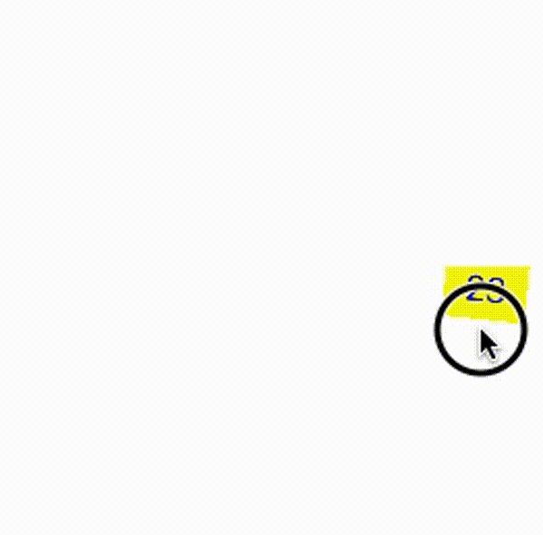
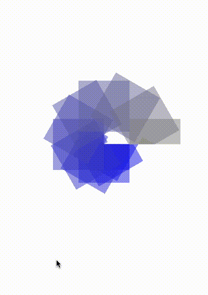

# PolarKit

[](https://travis-ci.org/alldne/PolarKit)

Bring the polar coordinate system into your iOS project!

## What is the PolarKit
As you know, UIView uses [Cartesian Coordinate System](https://en.wikipedia.org/wiki/Cartesian_coordinate_system).
PolarKit is a project that brings [Polar Coordinate System](https://en.wikipedia.org/wiki/Polar_coordinate_system) into the iOS world!

With the PolarKit, you can place your view with angle & radius.



### Goal
The goal of PolarKit is to provide UI components that has benefits when presented with the polar coordinate system.

PolarKit currently provides following components.
- `CircularScrollView`: Polar coordinated version of `UIScrollView`
- `RotatableView`: Simple rotatable view

## How to use
### CircularScrollView
```swift
import PolarKit
...
let circular = CircularScrollView(frame: frame)

// PolarCoordinatedView is just a subclass of UIView
let subview = PolarCoordinatedView(radius: 100, angle: Double.pi, frame: anotherFrame)

// Wrap your view with PolarCoordinatedView
subview.addSubview(yourView)

circular.addSubview(subview)
circular.contentLength = 2 * Double.pi
```


Once you remind UIScrollView, you can find out it has similar look-and-feel.

```swift
let scrollView = UIScrollView(frame: frame)
let subview = UIView(frame: anotherFrame)
scrollView.addSubview(subview)
scrollView.contentSize = CGSizeMake(width, height)
```

### RotatableView
```swift
import PolarKit
...
let rotatable = RotatableView(frame: frame)
rotatable.addSubview(yourViewToRotate)

// Setting the offset
rotatable.offset = Double.pi

// Adding an animation
// Unfortunately, `UIView.animateWithDuration()` is not supported
let anim = CABasicAnimation(keyPath: "offset")
anim.toValue = 2 * Double.pi
rotatable.layer.addAnimation(anim, forKey: "your-key")
```


## Requirements

- Swift 2.2

## Example

To run the example project,

1. Clone the repo
1. Run `pod install` from the Example directory
1. Open `Example/PolarKit.xcworkspace`
1. Run the target named `PolarKit-Example`

## Installation

PolarKit is going to available through [CocoaPods](http://cocoapods.org) **soon**. To install
it, simply add the following line to your Podfile:

```ruby
pod "PolarKit"
```

## Author

Jeong Yong-uk, ywj1022@gmail.com

## License

PolarKit is available under the MIT license. See the LICENSE file for more info.
